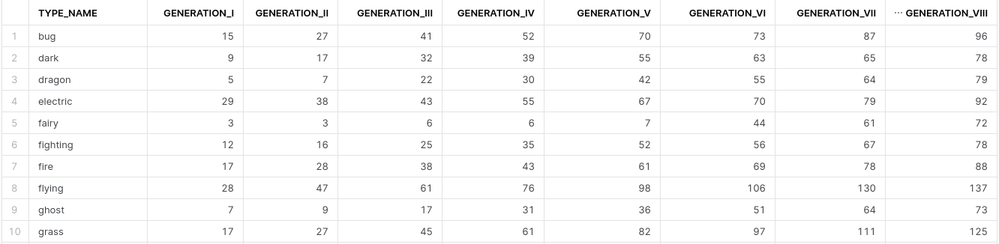

# Pokemons_Project
Ответы на вопросы:  
a) Сколько покемонов в каждом типе (type в терминах API), насколько это меньше чем у следующего по рангу типа? А насколько больше, чем у предыдущего?  
  

b) Сколько у разных атак (moves в терминах API) использующих их покемонов? + показать дельту от следующей и предыдущей по популярности атаки.  

c) Составить рейтинг покемонов по сумме их характеристик (stats в терминах API). Например, если у покемона есть только 2 статы: HP 20 & attack 25, то в финальный рейтинг идёт сумма характеристик: 20 + 25 = 45.  

d) Показать количество покемонов по типам (строки таблицы, type в терминах API) и поколениям (колонки таблицы, generations в терминах API).  

Структура проекта:
* dags/Bogdanov_PokemonsETL_DAG.py - файл с DAG ETL процесса PokeApi -> snowflake s3
* dags/Bogdanov_Check_Generations_DAG.py даг, ежедневно в полдень проверяющий количество generations и выводящий результат в лог соответствующей таски airflow
* dags/utils_Bogdanov содержит модули, обеспечивающие работу вышеприведенных DAGов 
* файлы, содержащие классы, представляющие основные сущности; классы парсеры; классы Encoder для представления сущностей в json форме для unprocessed и processed файлов, набор полей processed является подмножеством полей unprocessed, так как была поставлена цель максимально экономить место на s3, некоторые признаки (в частности species) выгружаются из API, используются в процессинге airflow, но не загружаются в s3->DWH
  * dags/utils_Bogdanov/pokemon.py
  * dags/utils_Bogdanov/generation.py
  * dags/utils_Bogdanov/move.py
  * dags/utils_Bogdanov/stat.py
  * dags/utils_Bogdanov/type.py
* dags/utils_Bogdanov/i_api_fetchable.py содержит базовый абстрактный класс для парсеров основных сущностей и абстрактный класс для парсеров json файлов, от которого наследуются классы-парсеры сущностей (так как в рамках проекта мы работали только с json файлами)
* dags/utils_Bogdanov/fetching_funcs.py содержит универсальную функцию _fetch_api_url_async, используемую во всех fetching тасках, данная функция позволяет асинхронно получать json файлы из API и преобразовывать в объекты классов-сущностей после чего сохранять каждый из объектов в отдельный json файл в mwaa/unprocessed, таким образом эта функция осуществляет первоначальную очистку от ненужных признаков
* dags/utils_Bogdanov/dag_functions.py содержит все функции, ассоцированные с Bogdanov_PokemonsETL_DAG.py
* dags/utils_Bogdanov/check_generations_dag_functions.py аналогично для Bogdanov_Check_Generations_DAG.py
* Snowflake_Deployment/ содержит скрипты для создания snowflake DWH, числовой префикс в названии файла определяет последовательность выполнения скриптов  

